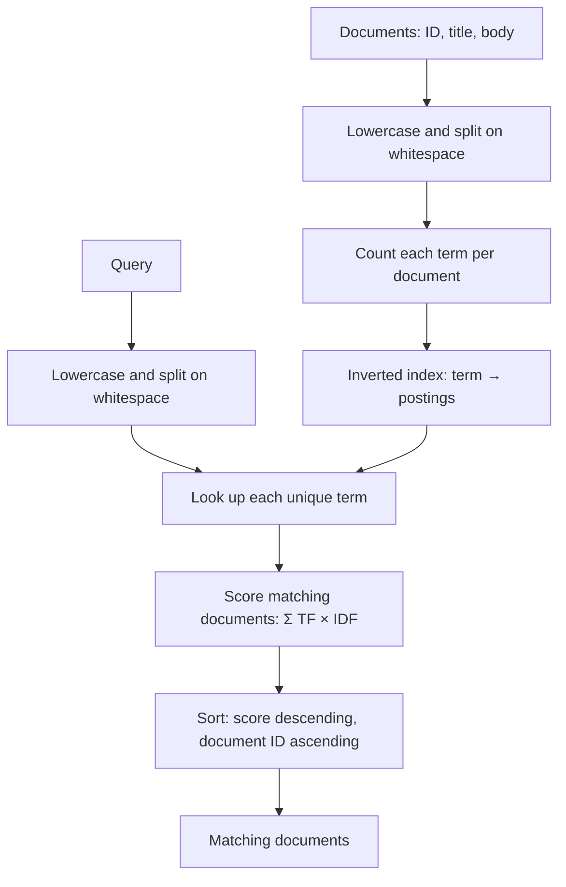

# Architecture

## Overview

MiniSearch is an in-memory Java search engine built in small steps. It keeps
documents by ID and an inverted index that maps each normalized term to a
posting list. A posting contains a document ID and that term's frequency in
the document.

## Evolution

| Stage | Problem | Smallest useful approach |
| --- | --- | --- |
| Prepared documents | Re-tokenizing content on every query wastes work. | Normalize title and body once when indexing. |
| Inverted index | Queries still inspect unrelated documents. | Map each term to matching document postings. |
| Multi-term ranking | OR matches have no useful order. | Rank by matched query terms. |
| Term frequency | One and many occurrences are treated the same. | Store one posting per document-term with its TF. |
| TF-IDF | Common terms can dominate rare, useful terms. | Score each posting as `TF × ln(N / df)`. |

## Current ranking

For every unique query term, MiniSearch reads its postings. For a posting,
the engine adds:

`termFrequency × ln(totalDocuments / documentFrequency)`

`documentFrequency` is the number of postings for the term. Results with the
same score are ordered by lower document ID.

## Current limits

- All documents and index data are in memory.
- Tokenization only lowercases and splits on whitespace; punctuation remains.
- Queries use OR semantics; phrase and AND queries are not supported.
- Scores do not account for document length or repeated-term saturation.
- Re-indexing an existing document ID is not supported as an update.

## Inverted-index performance

| Documents | Prepared scan | Index construction | Indexed query |
| ---: | ---: | ---: | ---: |
| 1,000 | 0.888 ms | 26.576 ms | 0.006 ms |
| 10,000 | 4.371 ms | 160.880 ms | 0.003 ms |
| 100,000 | 40.426 ms | 1319.405 ms | 0.004 ms |
