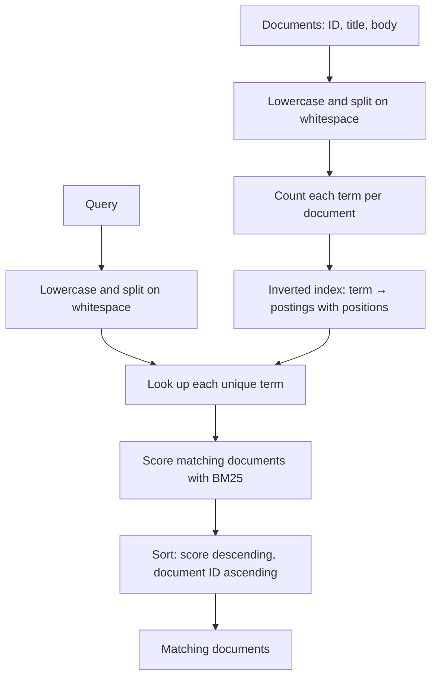

# Architecture

## Overview

MiniSearch is an in-memory Java search engine built in small steps. It keeps
documents by ID and an inverted index that maps each normalized term to a
posting list. A posting contains a document ID, that term's frequency, and
the token positions where it occurs in the document. Posting lists are kept in
ascending document-ID order.

## Evolution

| Stage | Problem | Smallest useful approach |
| --- | --- | --- |
| Prepared documents | Re-tokenizing content on every query wastes work. | Normalize title and body once when indexing. |
| Inverted index | Queries still inspect unrelated documents. | Map each term to matching document postings. |
| Multi-term ranking | OR matches have no useful order. | Rank by matched query terms. |
| Term frequency | One and many occurrences are treated the same. | Store one posting per document-term with its TF. |
| TF-IDF | Common terms can dominate rare, useful terms. | Score each posting as `TF × ln(N / df)`. |
| BM25 | Raw TF-IDF gives unlimited weight to repetition and favors long documents. | Saturate term frequency and normalize by document length. |
| Positional postings | A term-only index cannot tell whether query terms are adjacent and ordered. | Store every token position in each posting. |
| Boolean operations | OR matching and phrases cannot express required or excluded terms. | Merge sorted postings for intersection, union, and difference. |

## Current ranking

For every unique query term, MiniSearch reads its postings and adds a BM25
score. BM25 gives a larger score to rare terms, but repeated occurrences add
less value each time. It also compares a document's token count with the
average token count in the collection, so a match in a long document needs
more evidence than the same match in a short document.

MiniSearch uses `k1 = 1.2` to control term-frequency saturation and
`b = 0.75` to control document-length normalization. It stores each document's
token length and the total indexed token count to calculate the average.

Results with the same score are ordered by lower document ID.

## Phrase search

`searchPhrase("distributed systems")` looks for those terms next to each
other and in that order. It first uses the inverted index to find documents
that contain every phrase term. It then checks their stored positions. For
example, positions `0` for `distributed` and `1` for `systems` match; positions
`0` and `4` do not.

Title and body tokens are indexed separately for phrase matching. A one-token
gap between the two fields prevents a phrase from matching across their
boundary. Phrase results are returned by document ID; they do not receive a
BM25 boost.

## Boolean search

`searchAnd("java", "concurrency")` returns documents containing both terms.
`searchOr` returns documents containing either term. `searchAndNot("java",
"spring")` returns documents containing `java` but not `spring`.

These operations merge sorted posting lists with forward pointers. They return
documents in ascending document-ID order and do not use BM25, because they
answer whether a document satisfies a condition rather than how relevant it is.

## Current limits

- All documents and index data are in memory.
- Tokenization only lowercases and splits on whitespace; punctuation remains.
- Keyword queries use OR semantics. Exact phrase queries use the separate
  `searchPhrase` operation. Boolean queries use `searchAnd`, `searchOr`, and
  `searchAndNot`; quotation-mark parsing, parentheses, and a general query
  parser are not supported.
- Re-indexing an existing document ID is not supported as an update.

## Inverted-index performance

| Documents | Prepared scan | Index construction | Indexed query |
| ---: | ---: | ---: | ---: |
| 1,000 | 0.888 ms | 26.576 ms | 0.006 ms |
| 10,000 | 4.371 ms | 160.880 ms | 0.003 ms |
| 100,000 | 40.426 ms | 1319.405 ms | 0.004 ms |
