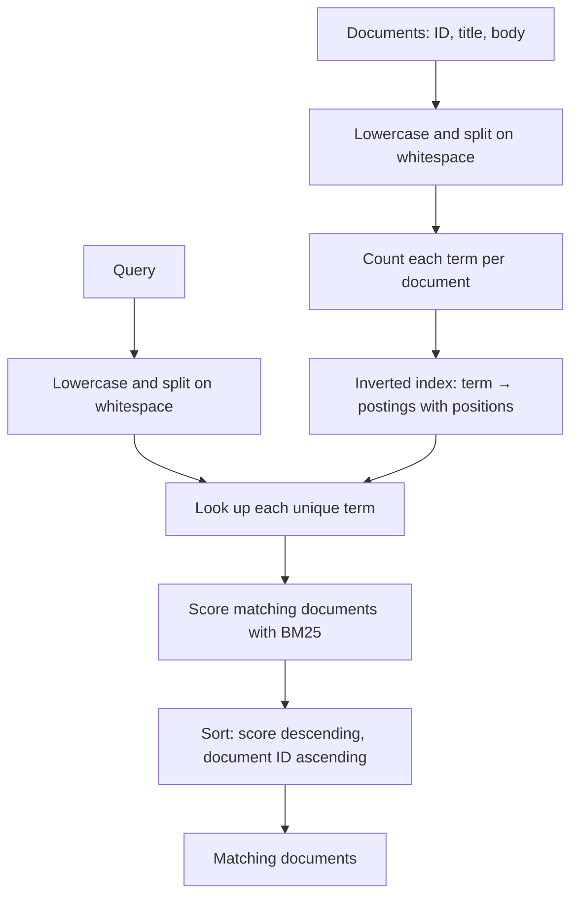

# Architecture

## Overview

MiniSearch is an in-memory Java search engine built in small steps. It keeps
documents by ID and an inverted index that maps each normalized term to a
posting list. A posting contains a document ID, that term's frequency, and
the token positions where it occurs in the document. Posting lists are kept in
ascending document-ID order.

## Evolution

| Stage | Problem | Smallest useful approach |
| --- | --- | --- |
| Prepared documents | Re-tokenizing content on every query wastes work. | Normalize title and body once when indexing. |
| Inverted index | Queries still inspect unrelated documents. | Map each term to matching document postings. |
| Multi-term ranking | OR matches have no useful order. | Rank by matched query terms. |
| Term frequency | One and many occurrences are treated the same. | Store one posting per document-term with its TF. |
| TF-IDF | Common terms can dominate rare, useful terms. | Score each posting as `TF × ln(N / df)`. |
| BM25 | Raw TF-IDF gives unlimited weight to repetition and favors long documents. | Saturate term frequency and normalize by document length. |
| Positional postings | A term-only index cannot tell whether query terms are adjacent and ordered. | Store every token position in each posting. |
| Boolean operations | OR matching and phrases cannot express required or excluded terms. | Merge sorted postings for intersection, union, and difference. |
| Top-K results | Sorting every match wastes work when a caller asks for only a few results. | Keep the best K scored documents in a bounded min-heap. |
| Autocomplete | Exact-term lookup cannot suggest terms for an incomplete prefix. | Scan the existing indexed vocabulary for matching prefixes. |
| Persistence | Process restarts lose all indexed state. | Save and load one complete versioned binary index file. |
| Immutable segments | Small updates rewrite the full persisted snapshot. | Flush new documents to a separate immutable index file. |
| Manual segment merge | Many small immutable segments add fixed work to reads. | Rebuild all persisted documents into one replacement segment. |

## Current ranking

For every unique query term, MiniSearch reads its postings and adds a BM25
score. BM25 gives a larger score to rare terms, but repeated occurrences add
less value each time. It also compares a document's token count with the
average token count in the collection, so a match in a long document needs
more evidence than the same match in a short document.

MiniSearch uses `k1 = 1.2` to control term-frequency saturation and
`b = 0.75` to control document-length normalization. It stores each document's
token length and the total indexed token count to calculate the average.

Results with the same score are ordered by lower document ID.

## Limited ranked results

### Problem

The caller requested only the top 10 results, but search originally fully
sorted every matching document.

### Evidence

Full sort + take 10:

| Matches | Average query time |
| ---: | ---: |
| 1K | 1.581 ms |
| 10K | 10.246 ms |
| 100K | 26.203 ms |

The experiment includes scoring as well as sorting, so it does not isolate
sorting cost. At this scale the latency is still reasonable; the concern is
that fully ordering M results performs work the caller does not need.

### New design

`search(query, limit)` still scores every matching document with BM25. While
scoring, it keeps at most `limit` candidates in a min-heap. The heap root is
the weakest current result: the lowest score, or the highest document ID when
scores tie. A better candidate replaces that root. The final winners are then
sorted by score descending and document ID ascending.

This changes selection from sorting all M matches, `O(M log M)`, to maintaining
at most K winners, `O(M log K)`. It does not avoid BM25 scoring for all M
matching documents.

### Comparison

Both experiments use the same generated corpus, query (`java`), limit (10),
three warmup runs, and five measured runs.

| Matches | Full sort + take 10 | Top-K heap |
| ---: | ---: | ---: |
| 1K | 1.581 ms | 1.426 ms |
| 10K | 10.246 ms | 9.433 ms |
| 100K | 26.203 ms | 18.417 ms |

At 100K matches the improvement is useful but not dramatic because scoring is
still required for every match. The heap removes only the unnecessary complete
ordering of losing results.

## Autocomplete

`suggest(prefix, limit)` returns known indexed terms that start with a
case-insensitive prefix. It scans the keys of the existing inverted index,
sorts matching terms alphabetically, and returns at most `limit` suggestions.
There is no separate vocabulary set, frequency ranking, fuzzy matching, or
prefix data structure.

### Realistic typing workload

The first 100K-term scan was under 10 ms for one suggestion. Autocomplete is
called once per keystroke, however. This experiment measures one
`suggest("distributed", 10)` call and a sequence of 11 ordinary calls for:
`d`, `di`, `dis`, `dist`, `distr`, `distri`, `distrib`, `distribu`,
`distribut`, `distribute`, and `distributed`.

The vocabulary always contains ten `distributed...` terms and otherwise uses
unique `token...` terms. Index construction happens before timing; each case
uses three warmup runs and five measured runs.

| Vocabulary | Single query | Full typing sequence |
| ---: | ---: | ---: |
| 100K | 3.947 ms | 43.064 ms |
| 500K | 15.106 ms | 173.659 ms |
| 1M | 29.818 ms | 339.551 ms |

The implementation is still a full vocabulary scan, `O(V)`, for every call.
At 1M terms the single query remains under 30 ms, but the typing sequence
performs eleven scans and reaches about 340 ms. The experiment exposes that
cost without choosing a replacement data structure yet.

## Persistence

`IndexStorage` saves and loads the complete in-memory index in one binary file.
The file starts with a magic value and format version, followed by documents
and their token lengths, total indexed token length, and term postings with
term frequency and positions. This is enough to reconstruct normal, phrase,
and Boolean search exactly after a restart.

Average document length and sorted vocabulary are derived after loading. They
are not stored because they can be rebuilt from persisted source state.

| Documents | Save time | Load time | File size |
| ---: | ---: | ---: | ---: |
| 1K | 69.067 ms | 35.789 ms | 0.250 MB |
| 10K | 312.438 ms | 175.281 ms | 2.523 MB |
| 100K | 2672.157 ms | 1592.068 ms | 25.428 MB |

The experiment builds the deterministic corpus before timing. Save and load
measure only the single-file operation. The snapshot format has no WAL,
background flush, merge, compression, or recovery. Saving a changed index
rewrites the whole file, and loading restores the whole file into memory.

## Immutable segments

`SegmentedSearchEngine` keeps a mutable in-memory index and a directory of
immutable segment files. Calling `flush()` saves the mutable index as the next
`segment-000001.bin`-style file, adds it to searchable segments, and starts a
fresh mutable index. Existing segment files are never modified.

Search, phrase, Boolean, and autocomplete queries run against every immutable
segment and the current mutable index. Their results are combined by document
ID. This is deliberately not global BM25 ranking: each segment currently has
only local collection statistics, so scores cannot yet be compared correctly
across segments.

| New documents flushed after a 100K-document segment | Flush time | New segment size |
| ---: | ---: | ---: |
| 1 | 0.922 ms | 0.000 MB |
| 100 | 3.882 ms | 0.026 MB |
| 1K | 35.096 ms | 0.257 MB |

The earlier full snapshot re-saves took seconds and rewrote about 25 MB for
the same update sizes. Segment flush writes only the new index data. There is
no automatic flush threshold, manifest, or background work.

## Manual segment merge

Many small segments make a query inspect many independent indexes. At 1,000
segments, a rare-term query spent visible time on per-segment lookup even
though almost every segment had no match.

`mergeAllSegments()` is an explicit operation. It rebuilds a new in-memory
index from the documents in all persisted segments, writes one new segment,
registers it, then removes the old files. The new file is written before any
old file is removed, so a failed write does not discard the existing segments.
The mutable index is not part of this operation.

The same 100K-document corpus was measured before and after merging 1,000
100-document segments. Each query used three warmup runs and five measured
runs.

| State | Segments | Rare query | Common query | Load time |
| --- | ---: | ---: | ---: | ---: |
| Before merge | 1K | 1.953 ms | 58.300 ms | 2660.841 ms |
| After merge | 1 | 0.011 ms | 37.433 ms | 1639.838 ms |

The merge itself took 51856.969 ms and produced a 13.578 MB segment. It
reduces read amplification, but it rewrites existing data. Merging remains
manual: MiniSearch has no threshold, selection policy, scheduler, or
background merge.

### Merge phase profile

The initial 51.857-second result measured one uninstrumented merge. A later
coarse profile keeps the same total 100K documents while changing only the
number of source segments. Segment loading happens when the engine opens, so
it is shown separately from the merge operation.

| Source layout | Load source segments | Read source documents | Re-index | Write | Cleanup | Merge total |
| --- | ---: | ---: | ---: | ---: | ---: | ---: |
| 1K × 100 docs | 2540.425 ms | 101.558 ms | 125542.718 ms | 4521.357 ms | 20.768 ms | 130186.401 ms |
| 100 × 1K docs | 2264.701 ms | 28.291 ms | 78561.806 ms | 2982.371 ms | 3.889 ms | 81576.357 ms |

These are exploratory runs, so their absolute times vary. The stable signal is
that rebuilding the already-indexed documents dominates both layouts. Reading
documents and handling source files are much smaller costs.

## Phrase search

`searchPhrase("distributed systems")` looks for those terms next to each
other and in that order. It first uses the inverted index to find documents
that contain every phrase term. It then checks their stored positions. For
example, positions `0` for `distributed` and `1` for `systems` match; positions
`0` and `4` do not.

Title and body tokens are indexed separately for phrase matching. A one-token
gap between the two fields prevents a phrase from matching across their
boundary. Phrase results are returned by document ID; they do not receive a
BM25 boost.

## Boolean search

`searchAnd("java", "concurrency")` returns documents containing both terms.
`searchOr` returns documents containing either term. `searchAndNot("java",
"spring")` returns documents containing `java` but not `spring`.

These operations merge sorted posting lists with forward pointers. They return
documents in ascending document-ID order and do not use BM25, because they
answer whether a document satisfies a condition rather than how relevant it is.

## Current limits

- All documents and index data are in memory.
- Tokenization only lowercases and splits on whitespace; punctuation remains.
- Keyword queries use OR semantics. Exact phrase queries use the separate
  `searchPhrase` operation. Boolean queries use `searchAnd`, `searchOr`, and
  `searchAndNot`; quotation-mark parsing, parentheses, and a general query
  parser are not supported.
- Autocomplete scans every indexed vocabulary term for each prefix request.
- `IndexStorage` rewrites and reloads one complete snapshot file. Segment
  flushes write only new data; manual segment merge rewrites persisted data.
- Cross-segment ranked search uses document-ID order until global BM25
  collection statistics are introduced.
- Re-indexing an existing document ID is not supported as an update.

## Inverted-index performance

| Documents | Prepared scan | Index construction | Indexed query |
| ---: | ---: | ---: | ---: |
| 1,000 | 0.888 ms | 26.576 ms | 0.006 ms |
| 10,000 | 4.371 ms | 160.880 ms | 0.003 ms |
| 100,000 | 40.426 ms | 1319.405 ms | 0.004 ms |
